# An Animated Map of the Earth

[](https://www.gnu.org/licenses/gpl-3.0)
[](https://twitter.com/eleanor_lutz)
[](https://github.com/eleanorlutz)

This repository explains how to make an animated map of Earth using open-source code and data from NASA, USGS, and Natural Earth. Software used includes `Python 3.7.1`, `Illustrator CC 2019` and `Photoshop CC 2019`. If you have comments or suggestions for this tutorial, please let me know [on my blog](http://tabletopwhale.com/2019/07/08/an-animated-map-of-earth.html)! You can also buy the [finished map here](https://www.redbubble.com/people/eleanorlutz/works/39425726) if you like.

**Python dependencies:** `matplotlib` `numpy` `cartopy` `glob` `pandas` `jupyter`. Dependencies can be installed with `pip install -r requirements.txt`.

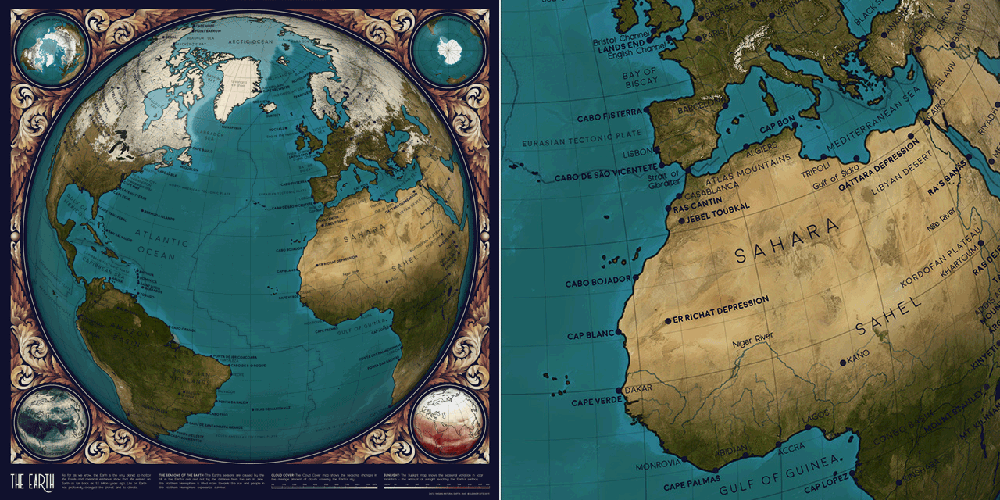

## Special instructions for beginners

##### If you're new to coding:

[Software Carpentry](https://software-carpentry.org/) has great tutorials for [installing Python](https://carpentries.github.io/workshop-template/) (scroll down and follow the directions in  the Bash Shell and Python sections), [getting starting with Jupyter Notebooks](http://swcarpentry.github.io/python-novice-inflammation/setup/index.html), and [beginner-friendly Python programming](http://swcarpentry.github.io/python-novice-inflammation/aio/index.html). After you've installed Python using these tutorials, you can use [Git Desktop](https://desktop.github.com/) and the instructions in [this tutorial](https://help.github.com/en/desktop/contributing-to-projects/cloning-a-repository-from-github-desktop) to download the code and data in this tutorial.

##### If you're new to design:

You'll need software for editing raster and vector images ([this article](https://vector-conversions.com/vectorizing/raster_vs_vector.html) explains the difference). I use [Adobe Photoshop](https://www.adobe.com/products/photoshop.html) and [Illustrator](https://www.adobe.com/products/illustrator.html), but you can also use the free open-source programs [Gimp](https://www.gimp.org/downloads/) and [Inkscape](https://inkscape.org/release/inkscape-0.92.4/). There is no perfect software that fits everyone's needs, so you'll want to understand the pros and cons for the different [raster](https://www.colorexpertsbd.com/blog/brief-comparison-photoshop-gimp) and [vector](https://logosbynick.com/inkscape-vs-illustrator-vs-coreldraw/) programs before choosing.

## Table of Contents

1. [Gathering and processing data](#data)
2. [Map design in Python](#python)
3. [Map design in Illustrator and Photoshop](#illustrator_photoshop)
4. [References](#references)
5. [License](#license)

<a name="data"/>

## Gathering and processing data

#### Animating NASA datasets

NASA publishes many Earth datasets at monthly time scales, and this GIF uses one frame per month to show the fluctuating seasons. The animation focuses mainly on data about Arctic sea ice and vegetation, but it was hard to choose - NASA has many other beautiful seasonal datasets, like fire, temperature, or rainfall.

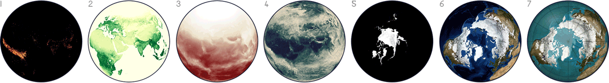

To show a few examples, the [NASA Earth Observations website](https://neo.sci.gsfc.nasa.gov/) includes data on seasonal [fire incidence](https://neo.sci.gsfc.nasa.gov/view.php?datasetId=MOD14A1_M_FIRE) (1), [vegetation](https://neo.sci.gsfc.nasa.gov/view.php?datasetId=MOD_NDVI_M) (2), [solar insolation](https://neo.sci.gsfc.nasa.gov/view.php?datasetId=CERES_INSOL_M), or the amount of sunlight (3), [cloud fraction](https://neo.sci.gsfc.nasa.gov/view.php?datasetId=MODAL2_M_CLD_FR) (4), [ice sheet coverage](https://neo.sci.gsfc.nasa.gov/view.php?datasetId=NISE_D) (5), and [processed satellite images](https://neo.sci.gsfc.nasa.gov/view.php?datasetId=BlueMarbleNG-TB) (6). My own map (7) combines the ice sheet data and the Blue Marble satellite images (6). The NEO database also has many more interesting datasets not shown here, like [rainfall](https://neo.sci.gsfc.nasa.gov/view.php?datasetId=TRMM_3B43M), [chlorophyll concentration](https://neo.sci.gsfc.nasa.gov/view.php?datasetId=MY1DMM_CHLORA), or [Carbon Monoxide](https://neo.sci.gsfc.nasa.gov/view.php?datasetId=MOP_CO_M).

#### NASA Blue Marble Images

The [NASA Blue Marble: Next Generation](https://neo.sci.gsfc.nasa.gov/view.php?datasetId=BlueMarbleNG-TB) image series is a digitally enhanced set of high-resolution Earth images available for every month in 2004. These satellite images have been edited by NASA to remove clouds and provide high spatial detail in many different types of surfaces (reflective glaciers, dark rainforests, and deep oceans). I downloaded each of these files as a `JPEG` at the highest resolution (0.1 degrees).

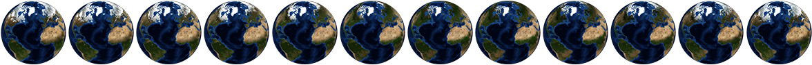

#### NASA Monthly Data

In addition to the Blue Marble color images, NASA has many datasets available for download in `CSV` format. These datasets are also available as images, but I decided to download the numerical data because some of the color schemes used by NASA didn't match my own map colors. By downloading the numerical data I could assign my own colormaps and fill in any small pieces of missing data.

To collect these datasets, go to the [NASA Earth Observations website](https://neo.sci.gsfc.nasa.gov/view.php?datasetId=MODAL2_M_CLD_FR), select `CSV` under the `File Type` selector on the right hand menu, and then click on the desired file resolution (I used 0.1 degrees for these maps).

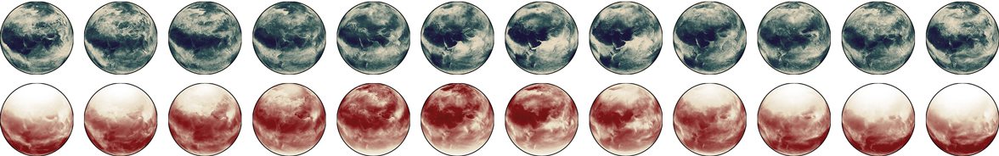

#### North and South Pole Datasets

This project was one of my first maps in the series, so the code is a little less streamlined than my [topographic maps](https://github.com/eleanorlutz/topography_atlas_of_space) or [geology maps](https://github.com/eleanorlutz/mars_geology_atlas_of_space). For this animation I made each of the small inset corner maps separately from the large central map and combined the figures in Photoshop. However, it would have been much faster to use gridspec in `matplotlib` to combine all five maps into the same image in Python. [This file](https://github.com/eleanorlutz/topography_atlas_of_space/blob/master/2_plot_maps.ipynb) in the [topographic map tutorial](https://github.com/eleanorlutz/topography_atlas_of_space) has a good example of this merging technique, if you're interested in replicating the five-panel map more efficiently.

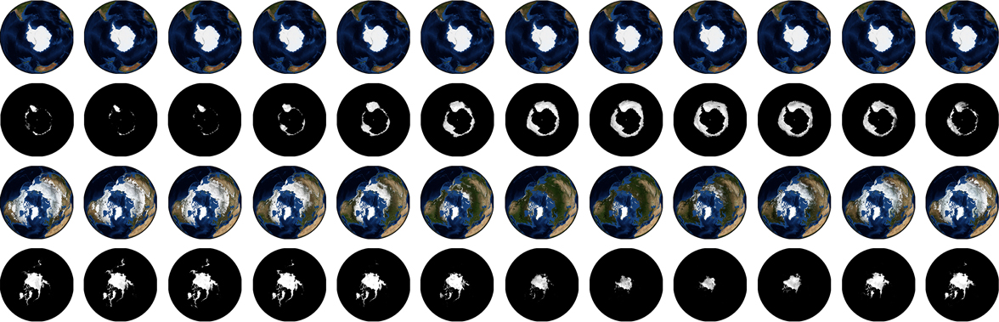

#### Natural Earth map labels

For the labels on this map I used data from [Natural Earth](https://www.naturalearthdata.com/downloads/10m-cultural-vectors/), a public domain mapping resource. Different types of map labels are stored in separate datasets, and for this map I downloaded the Natural Earth datasets for populated places, elevation points, glaciated areas, marine areas, and physical labels. I saved each of these as a separate `PDF` file so I could change the style of each type of label separately in Illustrator.

To match the rest of the space map collection, I decided to emphasize the natural features of the Earth. So I didn’t include any country borders, country names, or other political information (though I did include large cities because I thought they counted as interesting physical features). Instead I tried to use labels that emphasized the capes, oceans, deserts and forests of the world.

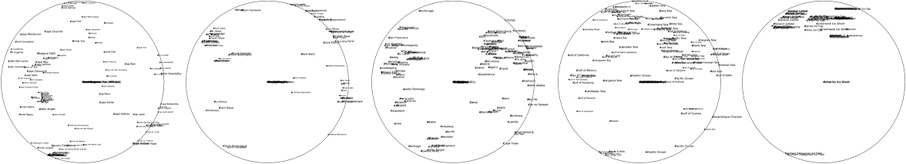

At the time that I wrote this code, the `cartopy` library had an issue that caused all text outside the boundaries of the map to be plotted in the very center. I tried several Python workarounds, but in the end it was fastest to zoom in to the center of each figure in Illustrator and manually remove all points plotted at the very center of the map. The issue may have been fixed in a subsequent `cartopy` update, but if you're seeing something similar in your maps this might be the reason.

#### Map Projections
I used an Orthographic projection for this map to visualize what the Earth looks like from outer space. The NASA datasets are provided in Plate Carrée format, and `cartopy` makes it easy to switch between commonly used projections like Plate Carrée and Orthographic. The same code in this repository can be used to create maps in any other [supported projection](https://scitools.org.uk/cartopy/docs/latest/crs/projections.html) by changing the axis projection variable `plt.axes(projection=cartopy.crs.Orthographic())`.

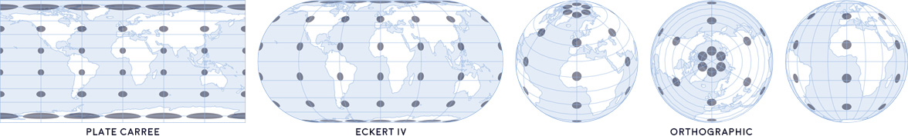

<a name="python"/>

## Map design in Python

Because this map is animated, the project involved a lot of Python output files. Some of the data stayed the same across all twelve months of the year (text labels, tectonic lines, coastlines, gridlines), but for other datasets I made a separate figure for each of the twelve frames (Blue Marble images, cloud cover, and solar insolation maps). To combine the separate images into one animated map, I first combined the static data together into one overlay layer. Next I pulled each of the twelve time-dependent figures into Photoshop and animated it using the `Timeline` feature. I've previously written [a detailed tutorial for animating in Photoshop](http://tabletopwhale.com/2014/11/03/how-to-make-an-animated-infographic.html), but you can also combine animation frames in many other programs (and even in Python itself).

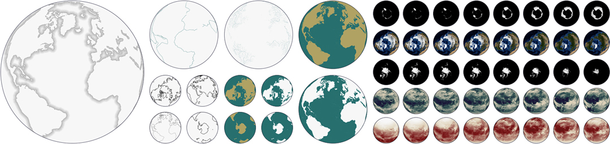

#### Saving Matplotlib figures

I usually save figures as a PDF so I can edit the text and shapes in Illustrator. There are a couple standard commands I use to export Matplotlib figures so they're easy to edit:

```python
import matplotlib
import matplotlib.pyplot as plt
import matplotlib.backends.backend_pdf as pdf

# Export text as editable text instead of shapes:
matplotlib.rcParams['pdf.fonttype'] = 42

# Preserve the vertical order of embedded images:
matplotlib.rcParams['image.composite_image'] = False

# Remove borders and ticks from subplots:
ax.axis('off')

# Remove padding and margins from the figure and all its subplots
plt.margins(0,0)
plt.subplots_adjust(top=1, bottom=0, right=1, left=0, hspace=0, wspace=0)
plt.gca().xaxis.set_major_locator(plt.NullLocator())
plt.gca().yaxis.set_major_locator(plt.NullLocator())

# Save the Matplotlib figure as a PDF file:
pp = pdf.PdfPages('./savename.pdf', keep_empty=False)
pp.savefig(fig)
pp.close()

# If I don't need to edit vector paths I save the file as a
# PNG so I can import it directly into Photoshop:
plt.savefig('./savename.png', format='png', dpi=600, pad_inches=0, transparent=True)
```

After saving the figure, the `PDF` file needs to be edited so that each object can be manipulated individually. In Illustrator,  select everything in the file and then go to `Object` --> `Clipping Mask` --> `Release`. At this point you can also delete the background and axis border objects, if you included them in the output file.

<a name="illustrator_photoshop"/>

## Map design in Illustrator and Photoshop

I export Python figures to Illustrator and Photoshop because several great design features are impossible or very time-consuming in Matplotlib. I'm linking tutorials here for the features I use most often - [font alternates](https://helpx.adobe.com/illustrator/using/special-characters.html) and [ligatures](https://helpx.adobe.com/illustrator/using/special-characters.html#use_ligatures_and_contextual_alternates), [custom brushes](https://helpx.adobe.com/illustrator/using/brushes.html), [layering effects](https://helpx.adobe.com/photoshop/using/layer-effects-styles.html), [blur effects](https://helpx.adobe.com/photoshop/using/blur-gallery.html), [gradients along a path](http://blog.gilbertconsulting.com/2017/06/using-gradients-on-strokes-in.html), [variable width paths](https://iamsteve.me/blog/entry/creating-custom-stroke-width-profiles-in-illustrator), [type on a path](https://helpx.adobe.com/illustrator/using/creating-type-path.html), and [selecting objects by characteristic](https://helpx.adobe.com/illustrator/using/selecting-objects.html#select_objects_by_characteristic).

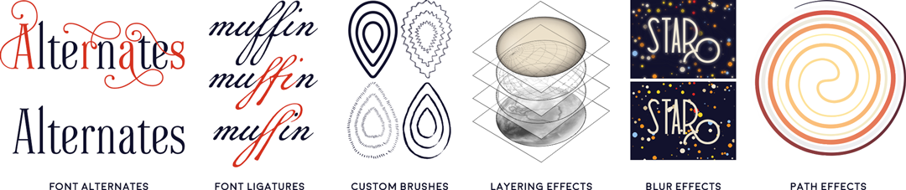

#### Layering in Photoshop

I've included a small section of the map in the `figures` folder as the Photoshop file `earth_sample.psd`. The file is small enough to upload online, but since it still has the original layers you should be able to use it as a reference for layering and color effects. I changed the colors of this map pretty significantly so that the dark labels would be legible across the globe.

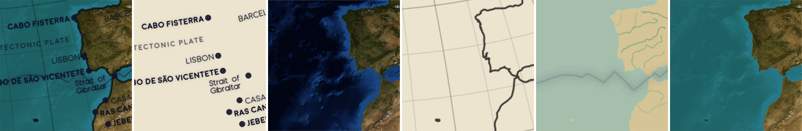

#### Text Annotation in Illustrator
I decided to annotate this map using text labels that followed the spherical contour lines of the planet. First I used Python to plot a series of latitude lines up and down the globe. I also made a Python output file that placed each text annotation next to a scatterpoint at the center of the feature. Finally I opened these files in Illustrator and manually combined each label with a nearby latitude line:
1. Use the `Type on a Path` tool to copy and paste the text for each object onto an appropriate latitude vector.
2. Use `Character` -> `Set the baseline shift` to center the text vertically to the desired location.

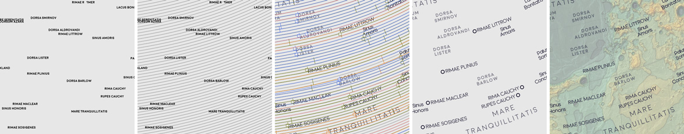

#### Shadows Underneath Text Labels in Photoshop

To create a shadow effect around the text labels, first save the text as a transparent `PNG` file and import it into Photoshop. Duplicate this annotation layer and go to `Filter` --> `Blur Gallery` --> `Field Blur`. For shadow text I usually create two blur layers set to 20% opacity - one with a `Blur` of 4px and the other 10px.

#### Color and Font

I wanted the maps in this series to look cohesive, so I made a palette of ~70 different colors and picked from these choices in every map. I also used the same two fonts ([Redflowers](https://creativemarket.com/TypeandStudio/923689-RedFlower-Typeface) and [Moon](https://harvatt.house/store/moon-font)) in all maps. You're welcome to use the color palette and font styling if you'd like.


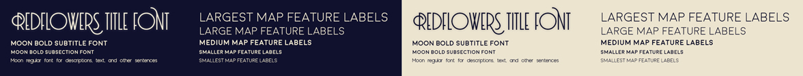

#### Designing a color scheme

To develop this set of colors, I started the project by designing 14 different color schemes. My initial idea was to have a unique color palette for every planet, but in the end I used the same collection of colors throughout all of the projects to make the maps look more cohesive.

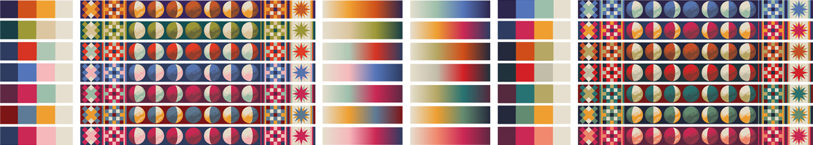

Each color palette is shown in several different ways, because I wanted to design versatile color schemes that could work as discrete elements, or as pieces of a complex pattern, or as a gradient in topographic maps. I updated these three visualizations while designing to make sure each color scheme would work for each application.

#### Decorative illustrations in Photoshop

For this project I wanted to combine large datasets with the hand-crafted design style of artists like William Morris or Alphonse Mucha. To organize my thoughts I collected a big folder of inspiration images from sources like the [New York Public Library Digital Database](https://www.nypl.org/):


When I started this project I initially wanted to design different border decorations for every topic. I sketched a collection of 18 different repeated patterns, each meant to go alongside a unique astronomy theme like planets, galaxies, space missions, or satellites.

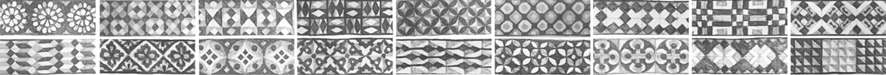

But as the project continued I realized there was so much data that the detailed borders made the maps look too cluttered. In the end I removed all of the borders and designed just one scrollwork illustration to wrap around rounded map projections. In these round maps I thought the shift from detailed map to blank paper was a bit too abrupt, so this was a good compromise between data-heavy and illustrative design styles.


For this scrollwork design I started with a pencil sketch, and tried a couple different iterations of leafy scrolls before finally picking a less botanically inspired design. When I paint decorations like these in Photoshop, I begin each design as a solid white shape and then gradually break away pieces into detailed chunks. Next, I brush away pieces of each section with the brush eraser tool until the pieces look like a fully-shaded monochrome design. I wait to add color until the very last step, where I use many different colors and overlay layers for a richer effect.

I've included two different examples of these painted Photoshop illustrations in the `figures` folder as `scrollwork_sample.psd` and `decorations_sample.psd`. These files still have the original layers, so you should be able to use it as a reference for layering, painting, and color effects.


<a name="references"/>

## References

- [Astronomy](https://openstax.org/details/astronomy). Andrew Fraknoi, David Morrison, Sidney C. Wolff et al. OpenStax 2016.
- [Blue Marble: Next Generation Topography and Bathymetry](https://neo.sci.gsfc.nasa.gov/view.php?datasetId=BlueMarbleNG-TB). NASA Earth Observations 2004.
- [Sea Ice Concentration and Snow Extent, Global (1 Day - SSM/I/DMSP)](https://neo.sci.gsfc.nasa.gov/view.php?datasetId=NISE_D&year=2017). NASA Earth Observations 2017.
- [Cloud Fraction (1 Month - AQUA/MODIS)](https://neo.sci.gsfc.nasa.gov/view.php?datasetId=MYDAL2_M_CLD_FR). NASA Earth Observations 2018.
- [Solar Insolation (1 Month)](https://neo.sci.gsfc.nasa.gov/view.php?datasetId=CERES_INSOL_M). NASA Earth Observations 2018.
- [Earth True Color (1 Day - NPP/VIIRS)](https://neo.sci.gsfc.nasa.gov/view.php?datasetId=VIIRS_543D). NASA Earth Observations 2019.
- [Tectonic Plate Boundaries](https://www.sciencebase.gov/catalog/item/4f4e4a48e4b07f02db62303e). USGS Spatial Services 2010.
- [Natural Earth 1:10m Cultural Vectors Populated Places](https://www.naturalearthdata.com/downloads/10m-cultural-vectors/). Natural Earth v4.1.0
- [Natural Earth 1:10m Physical Vectors River Centerlines](https://www.naturalearthdata.com/downloads/10m-physical-vectors/). Natural Earth v4.1.0
- [NASA Science Solar System Exploration](https://solarsystem.nasa.gov/). 2019.
- [Earth's Atmospheric Layers](https://www.nasa.gov/mission_pages/sunearth/science/atmosphere-layers2.html). NASA 2013.
- **Fonts:** [Moon](https://harvatt.house/store/moon-font) by Jack Harvatt and [RedFlower](https://creativemarket.com/TypeandStudio/923689-RedFlower-Typeface) by Type & Studio.
- **Advice:** Thank you to Chloe Pursey and Leah Willey for their helpful advice in making this map.

<a name="license"/>

## License

**Code:** All of the code in this repository is shared under the [GPL-3.0 license](https://www.gnu.org/licenses/gpl-3.0).

**Data:** The data in this repository belongs to the original authors of the data. Please use the references section to look up the original version. In cases where I edited or revised the data, I impose no additional restrictions to the original license. Any data files I created myself are shared under the [ODC Open Database License](https://opendatacommons.org/licenses/odbl/summary/).

**Artwork:** The artwork included in this repository are shared under a [Creative Commons Attribution-NonCommercial-NoDerivatives 4.0 International License](https://creativecommons.org/licenses/by-nc-nd/4.0/).
